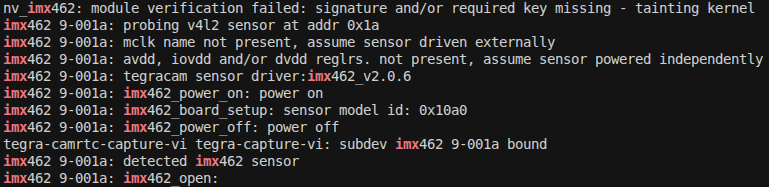

# IMX462 kernel driver for NVIDIA Jetson


NVIDIA Jetson kernel driver for Sony IMX462 — a 2 MP starvis back side illuminated CMOS sensor optimized for low-light and night-vision applications.

- 2-lane MIPI CSI-2
- 10-bit RAW output
- 1920×1080 @ 30 fps
- HCG (High Conversion Gain) mode for improved low-light SNR

> [!NOTE]
> Currently, only `cam0` port support is implemented.

## Setup

Install required tools:

```bash
sudo apt install -y --no-install-recommends dkms
```

Clone this repository:

```bash
cd ~
git clone https://github.com/Kurokesu/imx462-jetson-driver.git
cd imx462-jetson-driver/
```

Run setup script:

```bash
sudo ./setup.sh
```

Setup script:
- Fetches NVIDIA device tree headers required for build
- Builds and installs kernel module via [DKMS](https://github.com/dell/dkms)
- Builds and copies device tree overlay (`.dtbo`) to `/boot`
- Copies ISP calibration overrides to `/var/nvidia/nvcam/settings/`

Use Jetson-IO to configure the CSI connector:

```bash
sudo /opt/nvidia/jetson-io/jetson-io.py
```

Navigate through the menu:
1. Configure Jetson CSI Connector (named "22pin" on 6.2.2, "24pin" on 6.2.1)
2. Configure for compatible hardware
3. Select Camera IMX462-A


4. Save pin changes
5. Save and reboot to reconfigure pins

After reboot, verify sensor is detected:

```bash
sudo dmesg | grep imx462
```



## Image output

### GStreamer

```bash
gst-launch-1.0 -e nvarguscamerasrc sensor-id=0 ! \
   'video/x-raw(memory:NVMM),width=1920,height=1080,framerate=30/1' ! \
   queue ! nvvidconv ! queue ! nveglglessink
```

### NVIDIA sample camera capture application

```bash
nvgstcapture-1.0 --sensor-id 0
```

### Raw v4l2

Install `v4l-utils`:

```bash
sudo apt install -y v4l-utils
```

Stream raw data to file:

```bash
v4l2-ctl -d /dev/video0 --set-fmt-video=width=1920,height=1080,pixelformat=RG10 --stream-mmap --stream-to imx462_1080p.raw --stream-count=1 --stream-skip=10 --verbose
```

View raw Bayer file:

```bash
python3 view_raw.py ./imx462_1080p.raw
```

## HCG mode

IMX462 supports High Conversion Gain (HCG) mode for improved signal-to-noise ratio in low-light conditions. Default is Low Conversion Gain (LCG).

Enable HCG:

```bash
echo 1 | sudo tee /sys/module/nv_imx462/parameters/hcg_mode
```

Switch back to LCG:

```bash
echo 0 | sudo tee /sys/module/nv_imx462/parameters/hcg_mode
```

## Test mode

IMX462 has a built-in test pattern generator for verifying data validity.

Enable test pattern:

```bash
# Horizontal color‑bar chart example (test_mode = 2)
echo 2 | sudo tee /sys/module/nv_imx462/parameters/test_mode
```

Turn test pattern off:

```bash
echo 0 | sudo tee /sys/module/nv_imx462/parameters/test_mode
```

| Test pattern code | Description |
| ------------ | ----------- |
| 0 | Off |
| 1 | Sequence Pattern 1 |
| 2 | Horizontal Color-bar Chart |
| 3 | Vertical Color-bar Chart |
| 4 | Sequence Pattern 2 |
| 5 | Gradation Pattern 1 |
| 6 | Gradation Pattern 2 |
| 7 | 000h/555h Toggle Pattern |

## Development builds

For manual builds without DKMS:

```bash
make              # build everything (dtbo + kernel module)
sudo make install # copy dtbo to /boot, rmmod + insmod
```

> [!NOTE]
> Module is loaded immediately via `insmod` but won't persist across reboots. Use `sudo ./setup.sh` for permanent installation via DKMS.

Individual targets:

```bash
make dtbo      # build only the device tree overlay
make module    # build only the kernel module
make clean     # remove build artifacts
```

Build artifacts are placed in `./build`.
